<div align="center">



<a href="https://github.com/SWAPI03"></a>

<a href="https://www.linkedin.com/in/swapnil-yadav1"></a>
<a href="mailto:swapnil300303@gmail.com"></a>
<a href="https://www.kaggle.com/swapiy"></a>
<a href="https://leetcode.com/u/Swpai30"></a>


</div>

<br />

## 👋 About me

```python
class Swapnil:
    based_in  = "Lucknow, India"
    studying  = "B.Tech CSE (AI & DS) @ IIIT Manipur, 2023-27, CGPA 8.31"
    interned  = ["ML Intern @ FlyRank AI", "Data Science Intern @ DecodeLabs"]
    focus     = ["explainable AI", "computer vision", "LLM apps", "MLOps"]
    building  = "CVE Copilot, an LLM assistant for vulnerability triage"
    learning  = ["RAG", "fine-tuning", "agents"]
    open_to   = ["SWE / ML internships", "open source", "interesting ML problems"]
```

I like ML that can explain itself: Grad-CAM heatmaps, SHAP values, evals with real numbers behind them. Most of my projects end in an app or a dashboard, not just a notebook.

## 🚀 Featured projects

<p align="center">
  <a href="https://github.com/SWAPI03/cve-copilot"></a>
  <a href="https://github.com/SWAPI03/Chest_Xray_Disease_Detection"></a>
  <a href="https://github.com/SWAPI03/reliability-automl"></a>
  <a href="https://github.com/SWAPI03/telco-churn-prediction"></a>
</p>

<details>
<summary><b>More projects</b></summary>
<br />

| Project | What it does | Stack |
|---|---|---|
| [Fake News Detection](https://github.com/SWAPI03/Fake_News_Detection_NLP) | TF-IDF + Linear SVM on 44K news articles, 99.6% accuracy | `scikit-learn` `NLTK` |
| [Walmart Sales Forecasting](https://github.com/SWAPI03/WALMART-SALES-FORECASTING) | Weekly sales forecasts across stores and departments | `Pandas` `scikit-learn` |
| [Django Sentiment Analysis](https://github.com/SWAPI03/django-sentiment-analysis) | Sentiment classifier served through a Django web app | `Django` `NLTK` |
| [Pet Breed Classifier](https://github.com/SWAPI03/pytorch-image-classifier) 🚧 | ResNet transfer learning on 37 cat and dog breeds | `PyTorch` `torchvision` |
| [MLOps with DVC](https://github.com/SWAPI03/ML-OPS-DVC) | Versioned data and reproducible ML pipelines | `DVC` `Git` |

</details>

## 🏆 Achievements

<a href="https://www.kaggle.com/competitions/biohub-cell-tracking-during-development/leaderboard"></a>

- 🥉 **Kaggle Competition Bronze Medal**: Biohub Cell Tracking, 287th of 3,947 teams (top 8%)
- 🥇 **NPTEL Business Intelligence & Analytics**: Elite + Top 2%, scored **97%**
- 🥇 **NPTEL Introduction to Information Retrieval**: Elite + Top 2%, scored **93%**
- 💻 **250+ LeetCode problems** solved, 100+ of them medium or hard
- 🔀 **Merged contributions** to crewAI (59k★) and Composio (30k★)

## 🌍 Open source

I fix bugs in the AI tooling I use. Recent work in crewAI, LiteLLM, Composio and redis-py:

| Project | Pull request | Status |
|---|---|---|
|  **crewAI** | [Raise `ValueError` instead of a bare `raise` in `get_uploader`](https://github.com/crewAIInc/crewAI/pull/7283) |  |
|  **Composio** | [Fix `.jpg` resolving to non-standard `image/jpg`](https://github.com/ComposioHQ/composio/pull/4333) |  |
|  **xblock-ai-evaluation** | [Fix `language` field using `Scope=` instead of `scope=`](https://github.com/open-craft/xblock-ai-evaluation/pull/69) |  |
|  **LiteLLM** | [Label `.webm` as `audio/webm` in audio transcription](https://github.com/BerriAI/litellm/pull/39707) |  |
|  **crewAI** | [Make orphaned-shard cleanup work on Windows](https://github.com/crewAIInc/crewAI/pull/7690) |  |
|  **crewAI** | [Persist evaluation results as UTF-8](https://github.com/crewAIInc/crewAI/pull/7761) |  |
|  **redis-py** | [Fix `JSON.set_path` key derivation to strip only the extension](https://github.com/redis/redis-py/pull/4251) |  |

<sub>[See all my pull requests →](https://github.com/search?q=author%3ASWAPI03+is%3Apr+-user%3ASWAPI03&type=pullrequests)</sub>

## 💼 Experience

**Machine Learning Intern · FlyRank AI** &nbsp;`Jul 2026 - Sep 2026`<br />
Applied Search Intelligence: used ML to study how pages rank and get discovered on Google, working with FlyRank's anonymized search data (up to ~79M rows, queried through DuckDB). [Work repo](https://github.com/SWAPI03/flyrank-ai-internship)

**Data Science Intern · DecodeLabs** &nbsp;`Jun 2026 - Jul 2026`<br />
Built end-to-end ML pipelines covering EDA, feature engineering, SMOTE, PCA and K-Means, plus a fraud detection pipeline with ROC-AUC based model selection. [Task 1](https://github.com/SWAPI03/DecodeLabs_Intern_TASK1) · [Task 2](https://github.com/SWAPI03/DecodeLabs_Intern_TASK2)

## 🧰 Tech stack

<p align="center">
  
</p>

| Area | Tools |
|---|---|
| **ML / DL** |      |
| **LLMs** |     |
| **Data** |       |
| **Ship it** |      |

## 📊 Stats

<p align="center">
  
  <a href="https://leetcode.com/u/Swpai30"></a>
</p>

<p align="center">
  <picture>
    <source media="(prefers-color-scheme: dark)" srcset="https://raw.githubusercontent.com/SWAPI03/SWAPI03/output/snake-dark.svg" />
    <source media="(prefers-color-scheme: light)" srcset="https://raw.githubusercontent.com/SWAPI03/SWAPI03/output/snake-light.svg" />
    
  </picture>
</p>


